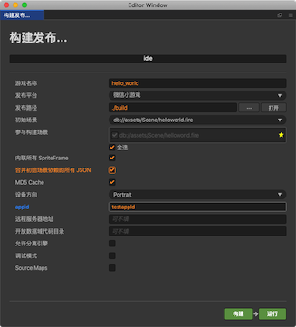
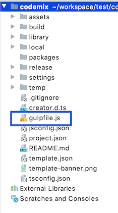
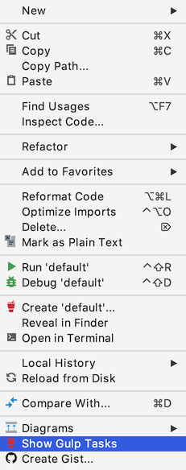
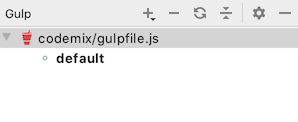
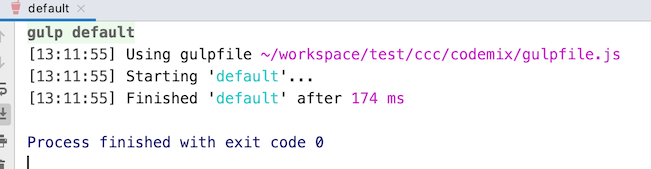
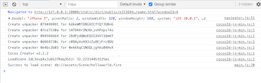
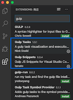
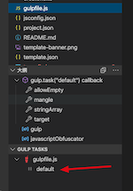
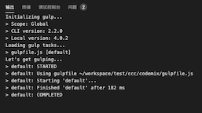
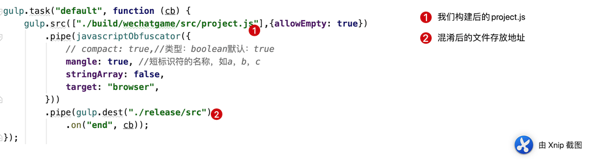

# 压缩项目简介

总的来说，目前市场上场景的 就是几种插件，首先我们要理解什么是压缩，什么是混淆

压缩 基本就是去掉不必要的部分。

- 空白字符
- 换行符
- 评论
- 阻止分隔符

这样的 可以在最后生成的代码的时候 去掉

很多常见的 比如 UglifyJS 、Terser、babel-minify、gulp-javascript-obfuscator等众多插件，甚至有些在线压缩和混淆也做的相当不错。此话题和压缩图片资源一样，是个长期的话题，为了节省时间，下面简单的说说如何用[gulp-javascript-obfuscator](https://github.com/javascript-obfuscator/javascript-obfuscator) 这个插件进行对 Cocos Creator 构建后的 project.js 进行混淆的

### 步骤

压缩前提：

- 首先用Cocos 新建一个项目比如 最简单的 Hello World
- 然后安装 node js 环境
- 安装 gulp 插件（我这边是4.0.2）
- 安装 gulp-javascript-obfuscator 压缩插件

#### 项目构建

1. 首先我们要用我们新建的项目 构建出一款小游戏，此处用 字节跳动开发工具（微信小游戏同理）
   
2. 等待构建完成后，我们开始在我们的根目录下面 新建一个 gulpfile.js 文件 作为我们的 gulp task
3. 

gulp.js 内容如下

```javascript
var gulp = require("gulp");
var javascriptObfuscator = require("gulp-javascript-obfuscator");
gulp.task("default", function (cb) {
    gulp.src(["./build/wechatgame/src/project.js"],{allowEmpty: true})
        .pipe(javascriptObfuscator({
            // compact: true,//类型：boolean默认：true
            mangle: true, //短标识符的名称，如a，b，c
            stringArray: false,
            target: "browser",
        }))
        .pipe(gulp.dest("./release/src")
            .on("end", cb));
});
```

#### Webstorm中运行Gulp  Task

1. 选中项目内的gulp.js 鼠标右键



2.  出现 gulp 窗口
   
3. 双击这个 黑色的 default 运行我们的脚本
   
4. 运行成功 查看我们的代码
   混淆前：

```javascript
window.__require=function t(e,r,o){function n(i,l){if(!r[i]){if(!e[i]){var u=i.split("/");if(u=u[u.length-1],!e[u]){var f="function"==typeof __require&&__require;if(!l&&f)return f(u,!0);if(c)return c(u,!0);throw new Error("Cannot find module '"+i+"'")}}var p=r[i]={exports:{}};e[i][0].call(p.exports,function(t){return n(e[i][1][t]||t)},p,p.exports,t,e,r,o)}return r[i].exports}for(var c="function"==typeof __require&&__require,i=0;i<o.length;i++)n(o[i]);return n}({Helloworld:[function(t,e,r){"use strict";cc._RF.push(e,"e1b90/rohdEk4SdmmEZANaD","Helloworld");var o=this&&this.__extends||function(){var t=function(e,r){return(t=Object.setPrototypeOf||{__proto__:[]}instanceof Array&&function(t,e){t.__proto__=e}||function(t,e){for(var r in e)e.hasOwnProperty(r)&&(t[r]=e[r])})(e,r)};return function(e,r){function o(){this.constructor=e}t(e,r),e.prototype=null===r?Object.create(r):(o.prototype=r.prototype,new o)}}(),n=this&&this.__decorate||function(t,e,r,o){var n,c=arguments.length,i=c<3?e:null===o?o=Object.getOwnPropertyDescriptor(e,r):o;if("object"==typeof Reflect&&"function"==typeof Reflect.decorate)i=Reflect.decorate(t,e,r,o);else for(var l=t.length-1;l>=0;l--)(n=t[l])&&(i=(c<3?n(i):c>3?n(e,r,i):n(e,r))||i);return c>3&&i&&Object.defineProperty(e,r,i),i};Object.defineProperty(r,"__esModule",{value:!0});var c=cc._decorator,i=c.ccclass,l=c.property,u=function(t){function e(){var e=null!==t&&t.apply(this,arguments)||this;return e.label=null,e.text="hello",e}return o(e,t),e.prototype.start=function(){this.label.string=this.text},n([l(cc.Label)],e.prototype,"label",void 0),n([l],e.prototype,"text",void 0),e=n([i],e)}(cc.Component);r.default=u,cc._RF.pop()},{}]},{},["Helloworld"]);
```

混淆后：

```javascript
window['__require']=function t(_0xb8615a,_0x34ed8f,_0x3c13d3){function _0x45f71b(_0x5f9f56,_0x1e6230){if(!_0x34ed8f[_0x5f9f56]){if(!_0xb8615a[_0x5f9f56]){var _0x365d31=_0x5f9f56['split']('/');if(_0x365d31=_0x365d31[_0x365d31['length']-0x1],!_0xb8615a[_0x365d31]){var _0x7e877d='function'==typeof __require&&__require;if(!_0x1e6230&&_0x7e877d)return _0x7e877d(_0x365d31,!0x0);if(_0x4cbfde)return _0x4cbfde(_0x365d31,!0x0);throw new Error('Cannot\x20find\x20module\x20\x27'+_0x5f9f56+'\x27');}}var _0x12926b=_0x34ed8f[_0x5f9f56]={'exports':{}};_0xb8615a[_0x5f9f56][0x0]['call'](_0x12926b['exports'],function(_0x406eb1){return _0x45f71b(_0xb8615a[_0x5f9f56][0x1][_0x406eb1]||_0x406eb1);},_0x12926b,_0x12926b['exports'],t,_0xb8615a,_0x34ed8f,_0x3c13d3);}return _0x34ed8f[_0x5f9f56]['exports'];}for(var _0x4cbfde='function'==typeof __require&&__require,_0x54b8b0=0x0;_0x54b8b0<_0x3c13d3['length'];_0x54b8b0++)_0x45f71b(_0x3c13d3[_0x54b8b0]);return _0x45f71b;}({'Helloworld':[function(_0x246df9,_0x3b700a,_0x22a66a){'use strict';cc['_RF']['push'](_0x3b700a,'e1b90/rohdEk4SdmmEZANaD','Helloworld');var _0x13840a=this&&this['__extends']||function(){var _0x4de8f0=function(_0x4e9a12,_0x47e3c3){return(_0x4de8f0=Object['setPrototypeOf']||{'__proto__':[]}instanceof Array&&function(_0x1e86d7,_0x3ff343){_0x1e86d7['__proto__']=_0x3ff343;}||function(_0x4537f2,_0x496368){for(var _0x4db7a3 in _0x496368)_0x496368['hasOwnProperty'](_0x4db7a3)&&(_0x4537f2[_0x4db7a3]=_0x496368[_0x4db7a3]);})(_0x4e9a12,_0x47e3c3);};return function(_0x589dcb,_0x2a7d9e){function _0x32aa1a(){this['constructor']=_0x589dcb;}_0x4de8f0(_0x589dcb,_0x2a7d9e),_0x589dcb['prototype']=null===_0x2a7d9e?Object['create'](_0x2a7d9e):(_0x32aa1a['prototype']=_0x2a7d9e['prototype'],new _0x32aa1a());};}(),_0x4a1fad=this&&this['__decorate']||function(_0x24e01e,_0x4b486f,_0x3604dd,_0x55da47){var _0x177a46,_0x3c5734=arguments['length'],_0x321086=_0x3c5734<0x3?_0x4b486f:null===_0x55da47?_0x55da47=Object['getOwnPropertyDescriptor'](_0x4b486f,_0x3604dd):_0x55da47;if('object'==typeof Reflect&&'function'==typeof Reflect['decorate'])_0x321086=Reflect['decorate'](_0x24e01e,_0x4b486f,_0x3604dd,_0x55da47);else for(var _0xc0b4c2=_0x24e01e['length']-0x1;_0xc0b4c2>=0x0;_0xc0b4c2--)(_0x177a46=_0x24e01e[_0xc0b4c2])&&(_0x321086=(_0x3c5734<0x3?_0x177a46(_0x321086):_0x3c5734>0x3?_0x177a46(_0x4b486f,_0x3604dd,_0x321086):_0x177a46(_0x4b486f,_0x3604dd))||_0x321086);return _0x3c5734>0x3&&_0x321086&&Object['defineProperty'](_0x4b486f,_0x3604dd,_0x321086),_0x321086;};Object['defineProperty'](_0x22a66a,'__esModule',{'value':!0x0});var _0x5f2d0e=cc['_decorator'],_0x215807=_0x5f2d0e['ccclass'],_0x21fa83=_0x5f2d0e['property'],_0x166402=function(_0x329cc9){function _0x2266a3(){var _0x5320ac=null!==_0x329cc9&&_0x329cc9['apply'](this,arguments)||this;return _0x5320ac['label']=null,_0x5320ac['text']='hello',_0x5320ac;}return _0x13840a(_0x2266a3,_0x329cc9),_0x2266a3['prototype']['start']=function(){this['label']['string']=this['text'];},_0x4a1fad([_0x21fa83(cc['Label'])],_0x2266a3['prototype'],'label',void 0x0),_0x4a1fad([_0x21fa83],_0x2266a3['prototype'],'text',void 0x0),_0x2266a3=_0x4a1fad([_0x215807],_0x2266a3);}(cc['Component']);_0x22a66a['default']=_0x166402,cc['_RF']['pop']();},{}]},{},['Helloworld']);
```

5.替换文件后 模拟器运行：




成功运行 没有报错。

#### Visual Studio Code中运行Gulp  Task

1. 首先我们要安装 Visual Studio Code，Visual Studio Code 作为一个轻量级的编辑器，Gulp task 运行 需要安装插件 。

- 下载插件：Gulp Snippets===>主要作用就是识别gulp 
- 下载插件Gulp Tasks==>主要是管理任务




2. 然后导入我们的项目 开始选择我们的gulp



出现 Gulp Tasks 管理窗口 同理双击运行：



3. 以上就是 用 VScode 运行Gulp Task

### 简单说明一下



这个就是 gulp 函数压缩的配置，这个插件还有更多的选项：

```javascript
var gulp = require("gulp");
var javascriptObfuscator = require("gulp-javascript-obfuscator");
gulp.task("obfuscator", function (cb) {
    gulp.src(["./build/web-mobile/src/project.js"], {allowEmpty: true})
        .pipe(javascriptObfuscator({
            compact: true,
            deadCodeInjection: false,
            debugProtection: false,
            debugProtectionInterval: false,
            disableConsoleOutput: false,
            domainLock: [".zz-game.com"],
            mangle: true,
            renameGlobals: false,
            rotateStringArray: false,
            seed: 0,
            selfDefending: false,
            stringArrayEncoding: false,
            stringArray: false,
            target: "browser",
            unicodeEscapeSequence: false
        }))
        .pipe(gulp.dest("./build/web-mobile")
            .on("end", cb));
});
```

但是更多的选项为 true 就混淆的更厉害，代码文件相应的会变大的更多。本人建议，适当即可。

最后 附上 demo 地址：

### 参考链接

- [vscode中执行gulp的task](https://juejin.im/post/5b44957b6fb9a04fae20f06e)
- [Cocos Creator—最佳构建部署实践](https://segmentfault.com/a/1190000012424893)
- [[译]Uglify vs Babel-minify vs Terser 一场代码压缩的pk](https://juejin.im/post/5d6cd666e51d4561cb5ddee6)
- [Javascript混淆与解混淆的那些事儿](http://blog.w3cub.com/blog/2019/04/01/js-confusion/)

